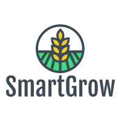
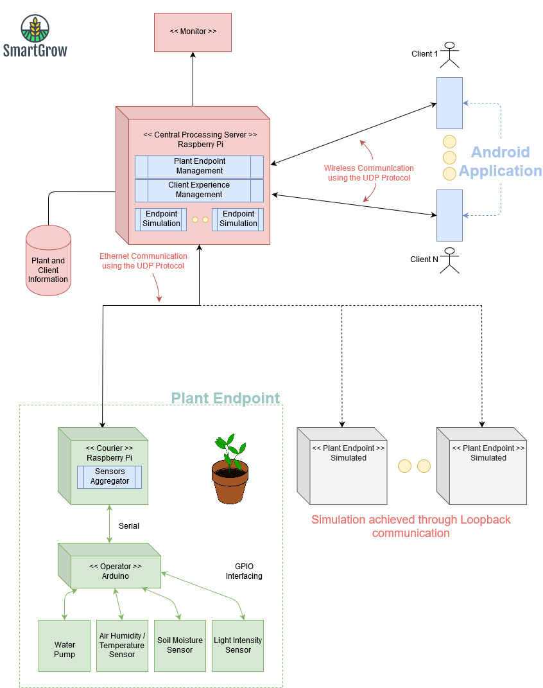

SmartGrow
===

    
    
Useful environmental information for your plants

**Developers**
===

Ahmed Sakr (@ahmedsakr)  
Valerie Figuracion (@vmfiguracion)  
Ashafaqul Haque (@Ashfaqul-007)

**About**
===

SmartGrow is developed for the purpose of facilitating the ease of growing plants in an optimal environment. Plants require certain levels of light exposure, watering, and air quality in order for optimal growth to be possible.

The idea is brought to life by a distributed set of systems communicating through the internet using the User Datagram Protocol (UDP). The following diagram is a high-level overview of the architecture of the SmartGrow System

    

