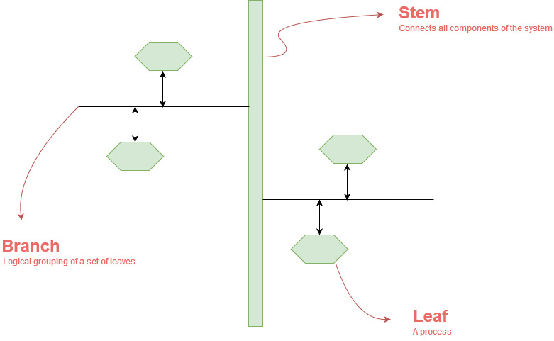

**SmartGrow Network**
===

The following diagram provides an architectural illustration of the networking framework for SmartGrow.

* **Stem**: The transport layer responsible for fulfilling message delivery from leaf-to-leaf across a distributed system in the network.
* **Branch**: A logical grouping of a set of leaves that allows for broadcasting of a message to all leaves on the branch.
* **Leaf**: A process that is listening to a specific port.